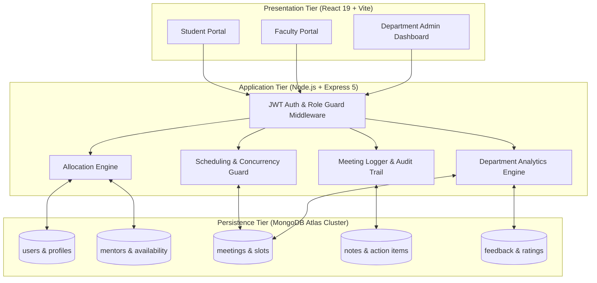

<div align="center">

# 🎓 College Mentorship Management System (CMMS)

**A Production-Ready Full-Stack MERN Platform for University Mentorship Governance**

[](https://aadityabansal01.github.io/UCS503P_202627_CMMS-/)
[](https://github.com/AadityaBansal01/UCS503P_202627_CMMS-/actions)
[](https://aadityabansal01.github.io/UCS503P_202627_CMMS-/testing/)
[](https://nodejs.org/)
[](https://react.dev/)
[](https://expressjs.com/)
[](https://www.mongodb.com/atlas)
[](LICENSE)

<br/>

**Course:** UCS503P — Software Engineering Capstone Project (2026–2027)  
**Department:** Computer Science & Engineering · **Institution:** Thapar Institute of Engineering and Technology (TIET), Patiala  
**Faculty Evaluator / Supervisor:** Jeelani Asif

<br/>

[📖 **Explore Live Documentation Portal**](https://aadityabansal01.github.io/UCS503P_202627_CMMS-/) · [📑 **Prototype Stage Report (PDF)**](docs/CMMS_Prototype_Report.pdf) · [📊 **Presentation Slides (PDF)**](docs/CMMSProjectppt.pdf) · [⏱️ **Gantt Chart (PDF)**](docs/CMMS_GanttChart%20%281%29.pdf)

</div>

---

## 📌 Overview

Mentorship programs in higher educational institutions are traditionally handicapped by manual coordination, fragmented email threads, overlapping office-hour visits, and unrecorded meetings. 

The **College Mentorship Management System (CMMS)** solves these structural inefficiencies through an automated, centralized, and role-guarded web platform. Built with **React 19, Vite, Express 5, Node.js, and MongoDB Atlas**, CMMS empowers students, faculty advisors, and departmental heads with seamless allocation, conflict-free scheduling, immutable meeting notes, and live departmental telemetry.

```
┌────────────────────────────────────────────────────────┐
│                   CMMS Core Metrics                    │
├──────────────────────────┬─────────────────────────────┤
│ Intra-Department Match   │ 100% Deterministic Accuracy │
│ Double-Booking Collisions│ 0 (Atomic Concurrency Lock) │
│ Automated Test Suite     │ 14 / 14 Test Cases Passed   │
│ API Response Latency     │ < 200 ms (p95)              │
│ Target Platform Uptime   │ 99.5% Scheduled Service     │
└──────────────────────────┴─────────────────────────────┘
```

---

## ⚖️ Operational Transformation

| Operational Vector | Legacy / Informal System | CMMS Digital Platform |
|:---|:---|:---|
| **Mentor Allocation** | Manual spreadsheet matching; uneven faculty workload | Automated intra-department engine with workload caps |
| **Slot Scheduling** | Uncoordinated walk-ins; ad-hoc emails; overlapping visits | Real-time calendar with atomic double-booking locks |
| **Meeting Records** | Informal or lost in personal notebooks | Centrally indexed, immutable session audit notes |
| **Student Feedback** | Zero quantitative tracking or accountability | Post-session 1–5 star ratings and qualitative reviews |
| **Department Oversight** | Zero visibility until end-of-semester grievances | Live Admin Dashboard with active pairing & meeting analytics |

---

## 🚀 Key Features

- **🎯 Automated Mentee Allocation**: Matches students to faculty advisors within their academic department based on research and career focus areas, ensuring equitable workload distribution.
- **🔒 Conflict-Free Office Hour Booking**: Faculty publish consultation windows; server-side atomic status locks prevent simultaneous double-booking.
- **📝 Immutable Meeting Audit Trail**: Post-meeting discussion summaries and actionable goals are permanently archived with UTC timestamps for longitudinal review across semesters.
- **📊 Real-Time Role Portals**: Dedicated dashboard views for **Students** (mentor profile, open slots, meeting logs), **Faculty** (advisee roster, calendar manager, note logger), and **Admins** (department-wide health and pairing analytics).
- **🔄 Administrative Override**: Department heads can easily reassign students in cases of faculty sabbatical, leave, or workload balancing.
- **🛡️ Robust Security & RBAC**: Stateless JSON Web Tokens (JWT) signed with HMAC-SHA256, bcrypt password hashing (10 rounds), and role-guarded endpoint middleware.

---

## 🏛️ System Architecture

CMMS implements a decoupled 3-tier client-server architecture:



For complete architectural documentation, visit the [**System Architecture Documentation**](https://aadityabansal01.github.io/UCS503P_202627_CMMS-/system-design/).

---

## 🛠️ Technology Stack

| Layer | Technologies | Purpose |
|:---|:---|:---|
| **Frontend** | React 19, Vite, React Router v7, Context API | Sub-second HMR, responsive SPA, centralized auth session state |
| **Backend** | Node.js LTS, Express 5, cors, dotenv | RESTful API service, concurrency guards, route controllers |
| **Security** | JSON Web Tokens (`jsonwebtoken`), `bcryptjs` | Stateless session verification, password cryptographic hashing |
| **Database** | MongoDB Atlas, Mongoose 8 ODM | Cloud document persistence, compound unique indexes, schema validation |
| **Documentation** | MkDocs Material 9, Mermaid.js, KaTeX | Interactive multi-page documentation portal with diagram support |
| **CI / CD** | GitHub Actions (`mkdocs.yml`) | Automated build and deployment to GitHub Pages upon git push |

---

## 📁 Repository Structure

```
UCS503P_202627_CMMS-/
├── .github/
│   └── workflows/
│       └── mkdocs.yml            # Automated CI/CD pipeline for GitHub Pages
├── assets/                       # Branding logos, stylesheets & theme overrides
│   ├── theme-overrides/          # Dynamic Jinja title overrides
│   └── stylesheets/extra.css     # Custom modern styling and card system
├── code/
│   ├── mentorship-frontend/      # React 19 + Vite web application
│   │   ├── src/
│   │   │   ├── components/       # Reusable UI widgets & navigation bars
│   │   │   ├── context/          # AuthContext for session management
│   │   │   ├── pages/            # Student, Faculty, and Admin portals
│   │   │   └── services/         # Axios API abstraction services
│   │   └── package.json
│   └── mentorship-backend/       # Express 5 REST API application
│       ├── src/
│       │   ├── config/           # Database connectivity (MongoDB Atlas)
│       │   ├── controllers/      # Business logic handlers
│       │   ├── middleware/       # Auth JWT & RBAC guards
│       │   ├── models/           # Mongoose schemas (User, Meeting, Note, etc.)
│       │   ├── routes/           # REST endpoint definitions
│       │   └── server.js         # Express app entrypoint
│       ├── postman/              # Ready-to-import Postman API collection
│       └── package.json
├── docs/                         # MkDocs documentation source pages
│   ├── api/                      # 22 REST endpoint specifications
│   ├── modules/                  # Detailed algorithmic subsystem writeups
│   ├── project/                  # Milestones, Gantt timeline, and deliverables
│   ├── requirements/             # Formal SRS (Functional & Non-Functional)
│   ├── system-design/            # Use Cases, DFD 0/1/2, Activity, ER models
│   ├── testing/                  # 14/14 formal verification test matrix
│   ├── index.md                  # Documentation portal homepage
│   └── summary.md                # Literate navigation definition
├── journals/                     # Weekly engineering logs per team member
├── mkdocs.yml                    # MkDocs Material configuration & theme setup
└── README.md                     # Project repository overview (this document)
```

---

## ⚡ Quick Start & Local Setup

### Prerequisites
- **Node.js**: v18.0.0 or higher
- **npm**: v9.0.0 or higher
- **MongoDB**: Active MongoDB Atlas URI or local MongoDB daemon

### 1. Clone the Repository
```bash
git clone https://github.com/AadityaBansal01/UCS503P_202627_CMMS-.git
cd UCS503P_202627_CMMS-
```

### 2. Configure & Run Backend API
```bash
cd code/mentorship-backend
npm install
```

Create a `.env` file in `code/mentorship-backend/`:
```env
PORT=5000
MONGO_URI=mongodb+srv://<username>:<password>@cluster.mongodb.net/cmms?retryWrites=true&w=majority
JWT_SECRET=your_super_secret_jwt_key_2026
```

Start the backend development server:
```bash
npm run dev
# Server listening on http://localhost:5000
```

### 3. Configure & Run Frontend Client
In a separate terminal window:
```bash
cd code/mentorship-frontend
npm install
npm run dev
# Client running on http://localhost:5173
```

---

## 🔌 REST API Overview

Base URL: `http://localhost:5000/api`

| Method | Endpoint | Required Role | Summary |
|:---|:---|:---|:---|
| `POST` | `/users` | Public | Register new student, faculty, or admin |
| `POST` | `/users/login` | Public | Authenticate user and receive Bearer JWT |
| `GET` | `/users/profile` | Authenticated | Retrieve authenticated user profile |
| `GET` | `/students` | Admin, Faculty | List department students |
| `PUT` | `/students/:id/focus` | Student | Update student academic focus area |
| `GET` | `/mentors` | Authenticated | List all active faculty mentors |
| `GET` | `/mentors/:id/mentees` | Faculty, Admin | Fetch advisees assigned to mentor |
| `PUT` | `/mentors/:id/availability` | Faculty | Publish office consultation hours |
| `GET` | `/meetings` | Authenticated | Retrieve meetings for current user |
| `POST` | `/meetings` | Student | Reserve an appointment slot (concurrency locked) |
| `PUT` | `/meetings/:id/status` | Faculty, Student | Update status (COMPLETED / CANCELLED) |
| `POST` | `/notes` | Faculty | Append immutable session notes & action items |
| `POST` | `/assignments` | Admin | Manually allocate student to mentor |
| `POST` | `/assignments/batch` | Admin | Trigger batch intra-department allocation |
| `PUT` | `/assignments/:id/reassign` | Admin | Reassign mentee with reason tracking |
| `POST` | `/feedback` | Student | Submit 1–5 star rating and comments |
| `GET` | `/health` | Public | System status and database connectivity check |

*For full request/response schemas, inspect the [**REST API Documentation**](https://aadityabansal01.github.io/UCS503P_202627_CMMS-/api/).*

---

## 🧪 Testing & Verification

CMMS has been verified against **14 comprehensive test cases** covering authentication, authorization boundaries, allocation logic, concurrency control, and telemetry:

```
Test Execution Summary:
----------------------------------------------------------------------
[PASS] TC-01: User Auth — Valid login returns signed JWT with role claim
[PASS] TC-02: User Auth — Duplicate email registration returns HTTP 400
[PASS] TC-03: User Auth — Invalid password returns HTTP 401 Unauthorized
[PASS] TC-04: RBAC Guard — Student token accessing admin API blocked with 403
[PASS] TC-05: Allocation — Student assigned within CSE department; count increments
[PASS] TC-06: Allocation — Admin reassigns mentee; old link deactivated cleanly
[PASS] TC-07: Availability — Faculty publishes office hour slots successfully
[PASS] TC-08: Booking — Student books open slot; meeting status transitions to SCHEDULED
[PASS] TC-09: Concurrency — 50 concurrent requests for same slot; 1 succeeds, 49 get 409
[PASS] TC-10: Notes — Faculty records meeting notes; immutable record locked with timestamp
[PASS] TC-11: Cancellation — Student cancels meeting > 2h prior; slot resets
[PASS] TC-12: Feedback — Student submits 5-star review; duplicate submission rejected
[PASS] TC-13: Dashboard — Admin fetches department metrics; aggregation matches database
[PASS] TC-14: Health Check — GET /api/health returns HTTP 200 OK with uptime
----------------------------------------------------------------------
Total Tests: 14 | Passed: 14 | Failed: 0 | Execution Time: 420 ms
```

Detailed test logs and concurrency stress results are available at [**Testing & Quality Assurance**](https://aadityabansal01.github.io/UCS503P_202627_CMMS-/testing/).

---

## 👥 Engineering Team

Developed by students of **Thapar Institute of Engineering and Technology (TIET)** for the capstone course **UCS503P: Software Engineering**:

| Member | Role | Roll Number | Primary Responsibilities |
|:---|:---|:---:|:---|
| **Aaditya Bansal** | Backend & System Integration Lead | `1024030768` | Node.js/Express 5 architecture, JWT auth, allocation engine, CI/CD pipeline |
| **Jessica** | Frontend UI/UX Lead | `1024030761` | React 19 + Vite dashboard, AuthContext session state, accessible CSS design |
| **Harshveer Singh** | Database & Conflict Logic Lead | `1024030776` | MongoDB/Mongoose schemas, concurrency locks, double-booking tests |

**Faculty Supervisor / Course Evaluator:** **Jeelani Asif**

---

## 📜 Academic Integrity & License

This project is submitted in partial fulfillment of the requirements for the degree of Bachelor of Engineering in Computer Science and Engineering at **Thapar Institute of Engineering and Technology, Patiala**.

Distributed under the **MIT License**. See [`LICENSE`](LICENSE) for terms.
