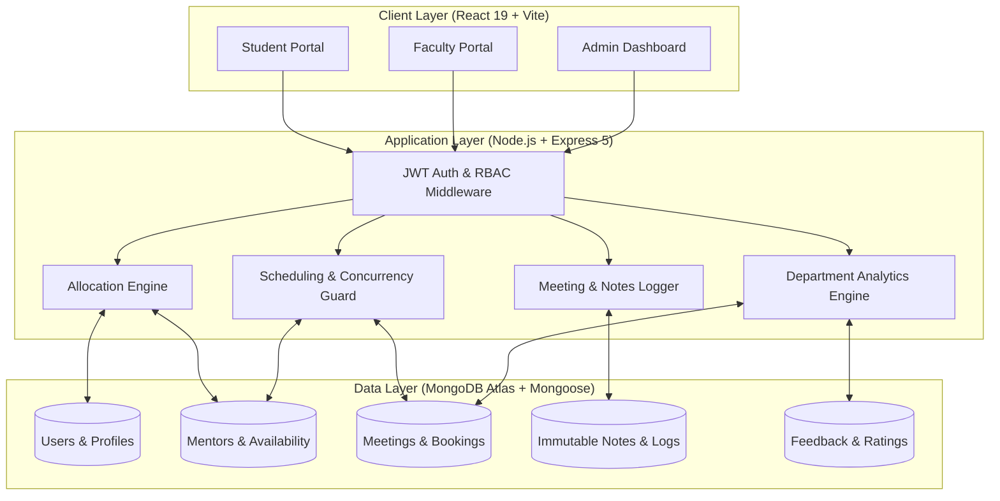

{ .tiet-logo }

  <h1>College Mentorship Management System (CMMS)</h1>
  

    A robust, modern full-stack MERN platform engineering automated faculty–student mentor allocation, concurrency-safe office hour scheduling, immutable meeting audit trails, and role-based departmental analytics.
  

  

    UCS503P: Software Engineering
    TIET Patiala
    MERN Stack
    Prototype Delivered
    14/14 Tests Passed
  

  

    <a href="system-design/index.md" class="btn-primary">Explore System Design &rarr;</a>
    <a href="api/index.md" class="btn-secondary">API Reference</a>
    <a href="https://github.com/AadityaBansal01/UCS503P_202627_CMMS-" target="_blank" class="btn-secondary">GitHub Repository</a>
  

  

    
100%

    
Intra-Dept Allocation

  

  

    
0

    
Double-Booking Conflicts

  

  

    
14 / 14

    
Test Cases Passed

  

  

    
&lt; 200 ms

    
API Response Latency

  

---

## 📌 Executive Summary

Mentorship programs in higher educational institutions frequently struggle with fragmented communication channels, manual paper/email coordination, mismatched faculty specializations, and unrecorded meetings. 

The **College Mentorship Management System (CMMS)** solves these structural inefficiencies through a unified digital architecture. Built on **React 19, Vite, Express 5, Node.js, and MongoDB Atlas**, CMMS delivers:

1. **Automated Mentee Allocation**: Matches students to faculty advisors based on department affiliation and academic focus areas.
2. **Conflict-Free Office Hour Booking**: Faculty publish available time windows; strict server-side concurrency locks block overlapping slots.
3. **Immutable Meeting Audit Trail**: Timestamped notes and post-session rating logs provide continuity across semesters.
4. **Role-Based Portals**: Dedicated interfaces for Students, Faculty Mentors, and Department Administrators with real-time engagement telemetry.

---

## ⚖️ Problem vs. Solution

| Operational Vector | Legacy / Informal Workflow | CMMS Digital Platform |
|:---|:---|:---|
| **Mentor Assignment** | Manual spreadsheet distribution; unbalanced workloads | Deterministic intra-department allocation with workload caps |
| **Slot Scheduling** | Ad-hoc emails, corridor walk-ins, frequent overlaps | Real-time conflict-free calendar with double-booking prevention |
| **Meeting Records** | Unrecorded or scattered in individual notebooks | Centrally indexed, timestamped, immutable session notes |
| **Student Feedback** | Zero quantitative tracking or accountability | Post-session 1–5 star ratings and qualitative notes |
| **Department Oversight**| Zero visibility until end-of-semester grievances | Live admin dashboard with mentee distribution & activity stats |

---

## 🏛️ High-Level Architecture

CMMS operates on a decoupled 3-tier client-server architecture with secure JWT authorization and role-based guards:

---

## ⚡ Core Capabilities

  

    
🎯

    <h3>Intelligent Allocation</h3>
    
Matches incoming students to departmental faculty using academic interest clustering while strictly honoring mentor capacity thresholds.

  

  

    
🔒

    <h3>Concurrency-Safe Scheduling</h3>
    
Prevents race conditions when multiple students attempt to claim the same office hour slot using atomic status transitions.

  

  

    
📝

    <h3>Session Archival</h3>
    
Structured post-meeting notes accessible only to involved parties, preserving advising context across academic terms.

  

  

    
📊

    <h3>Department Telemetry</h3>
    
Department heads monitor faculty workload balance, meeting frequencies, student completion rates, and average satisfaction ratings.

  

  

    
🛡️

    <h3>Role-Guarded RBAC</h3>
    
Stateless JWT authentication with role claims (Student, Faculty, Admin) and bcrypt password hashing.

  

  

    
🔄

    <h3>Administrative Override</h3>
    
Allows academic administrators to seamlessly reassign mentees in the event of faculty sabbatical, leave, or workload balancing.

  

---

## 🧭 Documentation Roadmap

Jump directly to any section of the technical documentation:

- [**System Design & Architecture**](system-design/index.md): Full breakdown of MERN architecture, Use Cases, DFD Levels 0/1/2, Activity Diagrams, and ER Schema models.
- [**System Requirements Specification (SRS)**](requirements/srs.md): Functional and non-functional requirements, acceptance criteria, and RBAC matrix.
- [**Core Modules & Algorithms**](modules/index.md): Allocation logic, double-booking prevention, audit trails, and reporting engines.
- [**REST API Reference**](api/index.md): Complete catalog of 22 endpoints across Users, Mentors, Students, Meetings, Notes, Assignments, and Feedback.
- [**Testing & Quality Assurance**](testing/index.md): Results for test cases TC-01 to TC-14, concurrency stress tests, and validation metrics.
- [**Milestones & Timeline**](project/timeline.md): 12-week project schedule across 6 phases, Gantt chart, and team responsibilities.
- [**Artifacts & Downloads**](project/artifacts.md): Access the formal Prototype Report PDF, Presentation Slides, and Gantt charts.

---

## 👥 Engineering Team & Academic Attribution

Developed under the curriculum of **UCS503P: Software Engineering Project**, Department of Computer Science & Engineering, **Thapar Institute of Engineering and Technology (TIET), Patiala**.

  

    
AB

    
Aaditya Bansal

    
Backend & Integration Lead

    
Roll No: 1024030768

  

  

    
J

    
Jessica

    
Frontend UI/UX Lead

    
Roll No: 1024030761

  

  

    
HS

    
Harshveer Singh

    
Database & Conflict Logic Lead

    
Roll No: 1024030776

  

> **Project Evaluator / Supervisor:** Jeelani Asif  
> **Course:** UCS503P — Software Engineering (2026–2027)  
> **Institution:** Thapar Institute of Engineering and Technology, Patiala, Punjab, India
