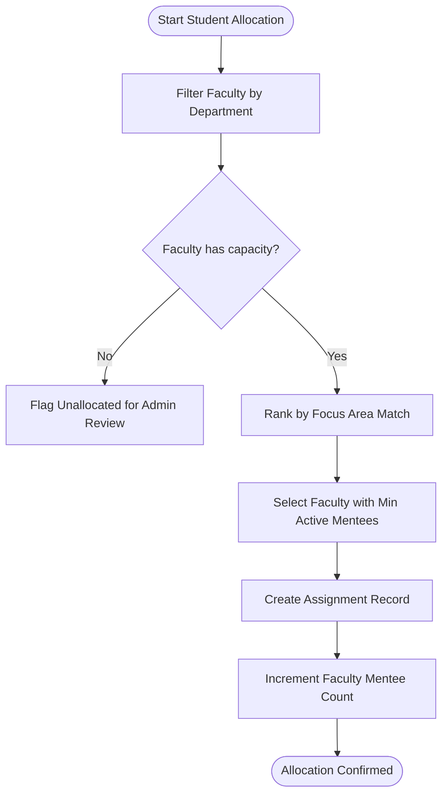

# ⚙️ Core Modules & Engineering Algorithms

The College Mentorship Management System (CMMS) is engineered around four core backend services designed to automate operational processes and prevent runtime data conflicts.

---

## 1. 🎯 Automated Allocation Engine

The Allocation Engine matches incoming students to faculty mentors within their department while strictly balancing workload distributions.

### Algorithmic Strategy
1. **Department Isolation**: Students and mentors are partitioned strictly by academic department:
   $$\text{Dept}(\text{Student}) \equiv \text{Dept}(\text{Mentor})$$
2. **Focus Area Affinity**: Mentors whose `researchAreas` overlap with the student's stated `focusArea` are prioritized.
3. **Capacity Constraint**: A mentor is eligible for assignment only if their active mentee count does not exceed capacity:
   $$\text{CurrentCount}(\text{Mentor}) < \text{MaxCapacity}(\text{Mentor})$$
4. **Workload Balancing**: Among eligible mentors with matching affinity, the student is assigned to the mentor with the minimum current load.



---

## 2. 🔒 Concurrency-Safe Scheduling Engine

One of the most critical challenges in appointment scheduling is **race condition vulnerability**: two students attempting to book the exact same open consultation slot at the same millisecond.

### Mechanism & Concurrency Guard
CMMS implements a 2-stage concurrency barrier:

1. **Database-Level Unique Constraint**: A compound unique index on `{ mentor: 1, slotDateTime: 1 }` prevents overlapping bookings at the storage layer.
2. **Atomic Query & Mutate**: Booking requests execute via atomic conditional updates:

```javascript
// Atomically reserve slot if status is still AVAILABLE
const reservedSlot = await Meeting.findOneAndUpdate(
  {
    _id: slotId,
    mentor: mentorId,
    status: 'AVAILABLE' // Concurrency predicate
  },
  {
    $set: {
      student: req.user.studentId,
      status: 'SCHEDULED',
      agenda: req.body.agenda,
      bookedAt: new Date()
    }
  },
  { new: true }
);

if (!reservedSlot) {
  // Slot was claimed by a concurrent transaction
  return res.status(409).json({
    success: false,
    message: 'Conflict: Slot has already been reserved by another student.'
  });
}
```

This guarantees **zero double-bookings** without requiring heavy distributed locks or blocking threads.

---

## 3. 📝 Immutable Meeting Logging & Audit Trail

Mentorship programs require an accountable historical record across semesters. CMMS implements append-only meeting records:

- **Sealed Records**: Once a meeting concludes, the faculty mentor logs notes and action items.
- **Immutability Principle**: Note records have `immutable: true` configured on timestamps and cannot be deleted or modified by students.
- **Action Item Tracking**: Action items are indexed as arrays of strings, enabling mentees to track deliverable progress prior to subsequent appointments.

---

## 4. 📊 Department Analytics Engine

The Department Analytics Engine powers the Administrative Dashboard by computing real-time metrics across all collections:

- **Mentee Coverage**: Ratio of total students allocated vs. awaiting mentor assignment.
- **Engagement Velocity**: Total completed consultation sessions over weekly and monthly intervals.
- **Workload Variance**: Standard deviation of mentee counts across faculty members, highlighting over-burdened or under-utilized advisors.
- **Quality Index**: Rolling average of student feedback scores (1–5) grouped by department and academic year.
