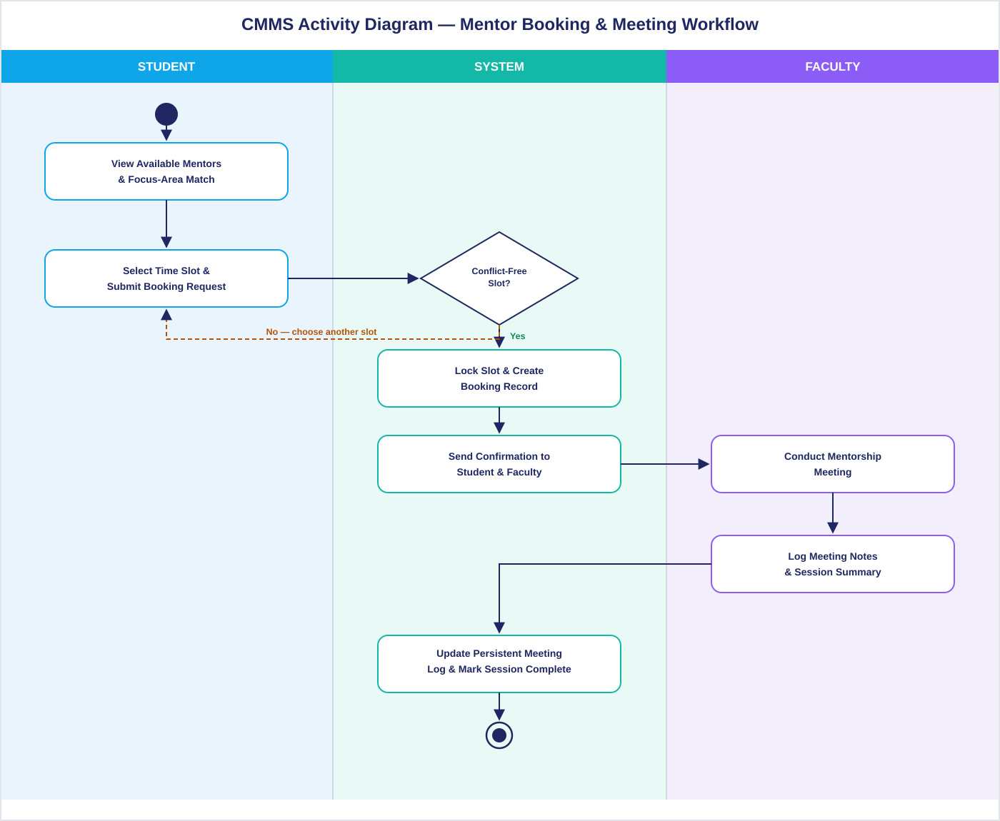

# ⚡ Activity & Workflow Diagrams

The Activity Diagram models the dynamic operational workflow of CMMS, detailing the end-to-end lifecycle of a mentorship cycle from onboarding through session feedback.

---

## 📈 Mentorship Lifecycle Diagram

=== "Interactive Mermaid Diagram"

    ```mermaid
    stateDiagram-v2
        [*] --> Registration: User Onboarding
        Registration --> RoleAssignment: Admin Verification
        
        state RoleAssignment {
            [*] --> ProfileSetup
            ProfileSetup --> AllocationQueue: Student submits focus areas
            ProfileSetup --> FacultySetup: Faculty configures capacity
        }

        AllocationQueue --> ActivePairing: Automated Engine or Admin Match
        FacultySetup --> ActivePairing

        state ActivePairing {
            [*] --> SlotPublication: Faculty creates office hours
            SlotPublication --> SlotBooking: Student selects open slot
            
            state SlotBooking {
                [*] --> CheckConcurrency
                CheckConcurrency --> Confirmed: Slot Available
                CheckConcurrency --> SlotPublication: Slot Taken (Conflict 409)
            }
            
            Confirmed --> ConductMeeting: Scheduled Session Date/Time
            ConductMeeting --> PostSessionLogging: Session Concluded
        }

        state PostSessionLogging {
            [*] --> RecordNotes: Faculty appends action items
            RecordNotes --> SubmitFeedback: Student provides 1-5 star rating
            SubmitFeedback --> ArchiveSession: Immutable audit commit
        }

        ArchiveSession --> ActivePairing: Next Advisory Cycle
        ArchiveSession --> [*]: Semester Concluded
    ```

=== "High-Resolution Render"

    <div class="diagram-frame">
      
      <div class="diagram-caption">Figure 5: High-Resolution UML Activity Diagram for the CMMS Session Lifecycle.</div>
    </div>

---

## 🔁 Step-by-Step Workflow Stages

### Stage 1: Student & Faculty Registration
1. Student registers with institutional email (`@thapar.edu`) and selects department & specialization.
2. Faculty registers with credentials, research domains, office location, and maximum mentee load.
3. System issues encrypted JWT tokens and initializes profile records.

### Stage 2: Automated Allocation
1. Department Admin triggers allocation run or manual reassignment.
2. System executes intra-department matching:
   $$\text{Department}(\text{Student}) = \text{Department}(\text{Mentor}) \quad \wedge \quad \text{CurrentMentees} < \text{Capacity}$$
3. Student and Faculty receive pairing notifications on their respective portals.

### Stage 3: Availability & Conflict-Free Booking
1. Faculty designates recurring or one-off consultation windows.
2. Student selects an available slot and submits an appointment agenda.
3. Concurrency guard validates slot availability in an atomic transaction; status transitions to `SCHEDULED`.

### Stage 4: Meeting Execution & Audit Logging
1. Meeting takes place (in-person or virtual).
2. Faculty accesses meeting dashboard and inputs official summary notes, milestones achieved, and follow-up deadlines.
3. Student accesses feedback portal and submits structured feedback (1–5 rating + optional comments).
4. All records are permanently sealed with UTC timestamps in MongoDB.
