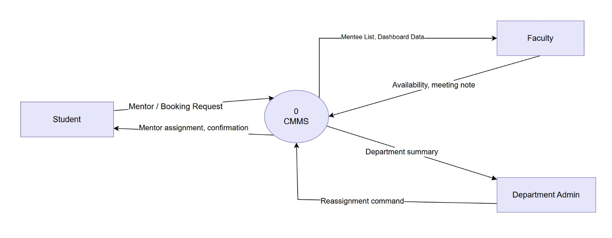
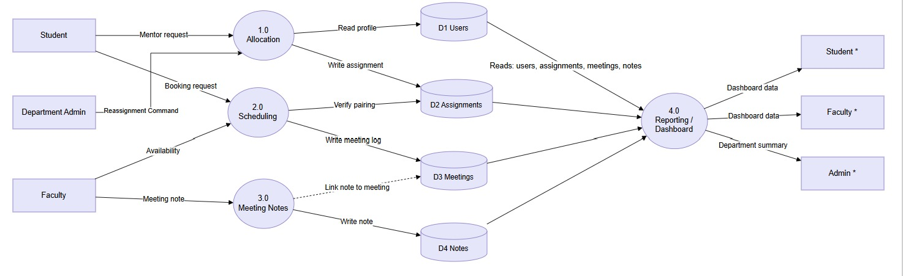
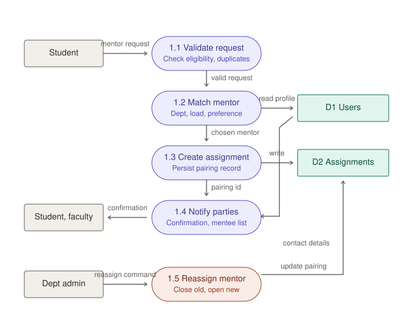

# 🔄 Data Flow Diagrams (DFDs)

Data Flow Diagrams illustrate how information traverses the College Mentorship Management System (CMMS). They model the boundary between external entities (Student, Faculty, Admin), computational processes, and data stores.

---

## 1. Level 0 DFD (Context Diagram)

The Level 0 Context Diagram represents the entire CMMS as a unified process node interacting with three primary external entities.

=== "Interactive Mermaid Diagram"

    ```mermaid
    flowchart LR
        %% Entities
        Student[Student]
        Faculty[Faculty Mentor]
        Admin[Department Admin]

        %% Main System Process
        System(("0.0<br/>CMMS Platform"))

        %% Student Data Flows
        Student -->|Profile & Focus Areas, Slot Bookings| System
        System -->|Assigned Mentor Details, Booking Confirmations, Notes| Student

        %% Faculty Data Flows
        Faculty -->|Availability Windows, Session Notes| System
        System -->|Mentee Rosters, Meeting Alerts| Faculty

        %% Admin Data Flows
        Admin -->|Reassignment Directives, Allocation Rules| System
        System -->|Department Analytics, Workload Statistics| Admin
    ```

=== "High-Resolution Image"

    <div class="diagram-frame">
      
      <div class="diagram-caption">Figure 2: Level 0 Context Diagram for CMMS.</div>
    </div>

---

## 2. Level 1 DFD (System Decomposition)

The Level 1 DFD decomposes process `0.0` into the four core subsystem services and details their interactions with the four primary persistent data stores.

=== "Interactive Mermaid Diagram"

    ```mermaid
    flowchart TD
        %% Entities
        Student[Student]
        Faculty[Faculty Mentor]
        Admin[Department Admin]

        %% Subsystem Processes
        P1(("1.0<br/>Mentee Allocation Engine"))
        P2(("2.0<br/>Scheduling & Concurrency"))
        P3(("3.0<br/>Meeting Logging & Audit"))
        P4(("4.0<br/>Department Analytics"))

        %% Persistent Data Stores
        DB_Users[("D1: User & Profile DB")]
        DB_Alloc[("D2: Allocation DB")]
        DB_Sched[("D3: Scheduling DB")]
        DB_Notes[("D4: Meeting Notes & Logs DB")]

        %% Student Interactions
        Student -->|1. Submit Focus Areas| P1
        Student -->|2. Select Open Slot| P2
        P2 -->|3. Confirmation Payload| Student
        Student -->|4. View Archived Notes| P3

        %% Faculty Interactions
        Faculty -->|5. Publish Availability| P2
        Faculty -->|6. Log Post-Meeting Notes| P3
        P1 -->|7. Dispatched Advisee Roster| Faculty

        %% Admin Interactions
        Admin -->|8. Reassignment Directives| P1
        P4 -->|9. Workload & Engagement Metrics| Admin

        %% Process to Data Store Flows
        P1 <-->|Read / Write User Attributes| DB_Users
        P1 <-->|Read / Write Pairings| DB_Alloc
        P2 <-->|Check & Reserve Slots| DB_Sched
        P3 <-->|Append Notes & Actions| DB_Notes

        %% Analytics Aggregation
        DB_Users -.->|Aggregates| P4
        DB_Alloc -.->|Aggregates| P4
        DB_Sched -.->|Aggregates| P4
        DB_Notes -.->|Aggregates| P4
    ```

=== "High-Resolution Image"

    <div class="diagram-frame">
      
      <div class="diagram-caption">Figure 3: Level 1 DFD depicting processes P1–P4 and data stores D1–D4.</div>
    </div>

---

## 3. Level 2 DFD (Decomposition)

### Process 1.0: Mentee Allocation Engine
Decomposes the automated allocation engine, parsing student interest profiles against faculty expertise constraints while maintaining load ceilings.

<div class="diagram-frame">
  
  <div class="diagram-caption">Figure 4: Level 2 DFD for Process 1.0 (Automated Mentee Allocation).</div>
</div>

### Process 2.0: Scheduling & Conflict-Free Booking
Decomposes the concurrency-protected booking engine:

```mermaid
flowchart TD
    %% Entities
    Student[Student]
    Faculty[Faculty Mentor]

    %% Sub-Processes
    P2_1(("2.1<br/>Create Office Hour Slots"))
    P2_2(("2.2<br/>Query Available Slots"))
    P2_3(("2.3<br/>Validate & Lock Slot"))
    P2_4(("2.4<br/>Generate Meeting Record"))

    %% Data Store
    DB_Sched[("D3: Scheduling DB")]

    %% Faculty Flow
    Faculty -->|Date, Time Window, Mode| P2_1
    P2_1 -->|Insert Open Slots| DB_Sched

    %% Student Query Flow
    Student -->|Browse Mentor Calendar| P2_2
    DB_Sched -->|Return Unreserved Slots| P2_2
    P2_2 -->|Display Slots| Student

    %% Student Booking Flow
    Student -->|Submit Booking Request| P2_3
    P2_3 <-->|Atomic Check (isBooked == false)| DB_Sched
    
    alt Slot Available
        P2_3 -->|Lock Slot (status=SCHEDULED)| P2_4
        P2_4 -->|Commit Meeting Document| DB_Sched
        P2_4 -->|HTTP 201 + Booking Confirmation| Student
        P2_4 -->|Meeting Alert Notification| Faculty
    else Slot Already Claimed
        P2_3 -->>|HTTP 409 Conflict Rejection| Student
    end
```

---

## 🗄️ Persistent Data Store Directory

| Store ID | Name | Underlying Collection | Scope & Purpose |
|:---|:---|:---|:---|
| **D1** | User & Profile DB | `users`, `students`, `mentors` | Authentication credentials, department affiliations, research focus tags. |
| **D2** | Allocation DB | `assignments` | Active and historical student-mentor mappings with start/end timestamps. |
| **D3** | Scheduling DB | `meetings` | Available slots, booked sessions, recurrence schedules, cancellation states. |
| **D4** | Meeting Notes & Logs DB | `notes`, `feedbacks` | Immutable post-meeting discussions, follow-up goals, and student satisfaction ratings. |
