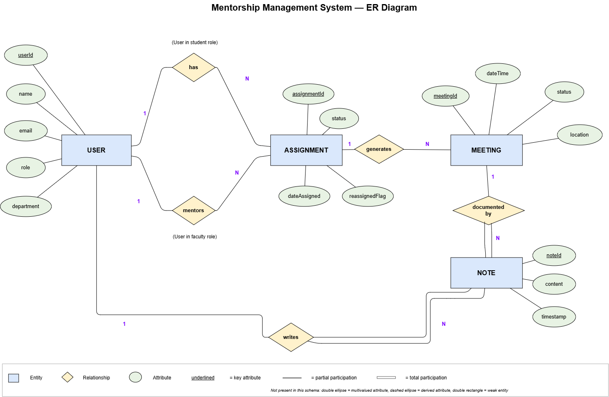

# 🗃️ Entity Relationship (ER) Diagram & Schemas

The persistence tier of CMMS is implemented using **MongoDB Atlas** with **Mongoose ODM**. While MongoDB is a document-oriented database, CMMS maintains strict normalized relational integrity through Mongoose `ObjectId` references, schema-level validation constraints, and foreign key relationships.

---

## 📊 Entity Relationship Diagram

=== "Interactive Mermaid ERD"

    ```mermaid
    erDiagram
        USER ||--o| STUDENT : "specializes as"
        USER ||--o| MENTOR : "specializes as"
        MENTOR ||--o{ ASSIGNMENT : "is assigned to"
        STUDENT ||--o{ ASSIGNMENT : "receives"
        MENTOR ||--o{ MEETING : "hosts"
        STUDENT ||--o{ MEETING : "attends"
        MEETING ||--o| NOTE : "documents"
        MEETING ||--o| FEEDBACK : "evaluated by"

        USER {
            ObjectId _id PK
            string name
            string email UK
            string password
            string role "STUDENT | FACULTY | ADMIN"
            string department
            datetime createdAt
        }

        STUDENT {
            ObjectId _id PK
            ObjectId user FK
            string rollNumber UK
            int academicYear
            string focusArea
            ObjectId assignedMentor FK
            string status "ACTIVE | GRADUATED"
        }

        MENTOR {
            ObjectId _id PK
            ObjectId user FK
            string designation
            string[] researchAreas
            int maxCapacity
            int currentMenteeCount
            string officeLocation
            string availability
        }

        ASSIGNMENT {
            ObjectId _id PK
            ObjectId student FK
            ObjectId mentor FK
            ObjectId assignedBy FK
            string status "ACTIVE | REASSIGNED"
            datetime assignedAt
            datetime reassignedAt
        }

        MEETING {
            ObjectId _id PK
            ObjectId mentor FK
            ObjectId student FK
            datetime slotDateTime
            int durationMinutes
            string status "SCHEDULED | COMPLETED | CANCELLED"
            string agenda
            string mode "IN_PERSON | ONLINE"
        }

        NOTE {
            ObjectId _id PK
            ObjectId meeting FK
            ObjectId mentor FK
            ObjectId student FK
            string content
            string[] actionItems
            datetime createdAt
        }

        FEEDBACK {
            ObjectId _id PK
            ObjectId meeting FK
            ObjectId student FK
            ObjectId mentor FK
            int rating "1 to 5"
            string comments
            datetime createdAt
        }
    ```

=== "High-Resolution Render"

    <div class="diagram-frame">
      
      <div class="diagram-caption">Figure 6: High-Resolution Entity-Relationship Diagram detailing all CMMS database collections and relational cardinalities.</div>
    </div>

---

## 📑 Database Schema Specifications

### 1. `User` Schema
Core identity record supporting authentication and authorization across all system personas.
```javascript
const userSchema = new mongoose.Schema({
  name: { type: String, required: true, trim: true },
  email: { type: String, required: true, unique: true, lowercase: true },
  password: { type: String, required: true }, // bcrypt 10-round hash
  role: { 
    type: String, 
    required: true, 
    enum: ['STUDENT', 'FACULTY', 'ADMIN'],
    default: 'STUDENT'
  },
  department: { type: String, required: true },
  createdAt: { type: Date, default: Date.now }
});
```

### 2. `Student` Schema
Specific student demographic and advisory status profile.
```javascript
const studentSchema = new mongoose.Schema({
  user: { type: mongoose.Schema.Types.ObjectId, ref: 'User', required: true },
  rollNumber: { type: String, required: true, unique: true },
  academicYear: { type: Number, required: true, min: 1, max: 5 },
  focusArea: { type: String, required: true },
  assignedMentor: { type: mongoose.Schema.Types.ObjectId, ref: 'Mentor' },
  status: { type: String, enum: ['ACTIVE', 'GRADUATED'], default: 'ACTIVE' }
});
```

### 3. `Mentor` Schema
Faculty advisory profile with capacity management and office availability.
```javascript
const mentorSchema = new mongoose.Schema({
  user: { type: mongoose.Schema.Types.ObjectId, ref: 'User', required: true },
  designation: { type: String, required: true },
  researchAreas: [{ type: String }],
  maxCapacity: { type: Number, default: 15 },
  currentMenteeCount: { type: Number, default: 0 },
  officeLocation: { type: String, required: true },
  availability: { type: String, default: 'Mon-Fri 10:00-12:00' }
});
```

### 4. `Meeting` Schema
Represents an appointment slot or confirmed session.
```javascript
const meetingSchema = new mongoose.Schema({
  mentor: { type: mongoose.Schema.Types.ObjectId, ref: 'Mentor', required: true },
  student: { type: mongoose.Schema.Types.ObjectId, ref: 'Student', required: true },
  slotDateTime: { type: Date, required: true },
  durationMinutes: { type: Number, default: 30 },
  status: { 
    type: String, 
    enum: ['SCHEDULED', 'COMPLETED', 'CANCELLED'],
    default: 'SCHEDULED' 
  },
  agenda: { type: String, required: true },
  mode: { type: String, enum: ['IN_PERSON', 'ONLINE'], default: 'IN_PERSON' }
});

// Compound unique index to enforce conflict-free booking per mentor
meetingSchema.index({ mentor: 1, slotDateTime: 1 }, { unique: true });
```

### 5. `Note` Schema
Immutable audit log of meeting proceedings.
```javascript
const noteSchema = new mongoose.Schema({
  meeting: { type: mongoose.Schema.Types.ObjectId, ref: 'Meeting', required: true },
  mentor: { type: mongoose.Schema.Types.ObjectId, ref: 'Mentor', required: true },
  student: { type: mongoose.Schema.Types.ObjectId, ref: 'Student', required: true },
  content: { type: String, required: true },
  actionItems: [{ type: String }],
  createdAt: { type: Date, default: Date.now, immutable: true }
});
```

### 6. `Feedback` Schema
Student evaluation and satisfaction rating.
```javascript
const feedbackSchema = new mongoose.Schema({
  meeting: { type: mongoose.Schema.Types.ObjectId, ref: 'Meeting', required: true, unique: true },
  student: { type: mongoose.Schema.Types.ObjectId, ref: 'Student', required: true },
  mentor: { type: mongoose.Schema.Types.ObjectId, ref: 'Mentor', required: true },
  rating: { type: Number, required: true, min: 1, max: 5 },
  comments: { type: String, trim: true },
  createdAt: { type: Date, default: Date.now }
});
```
