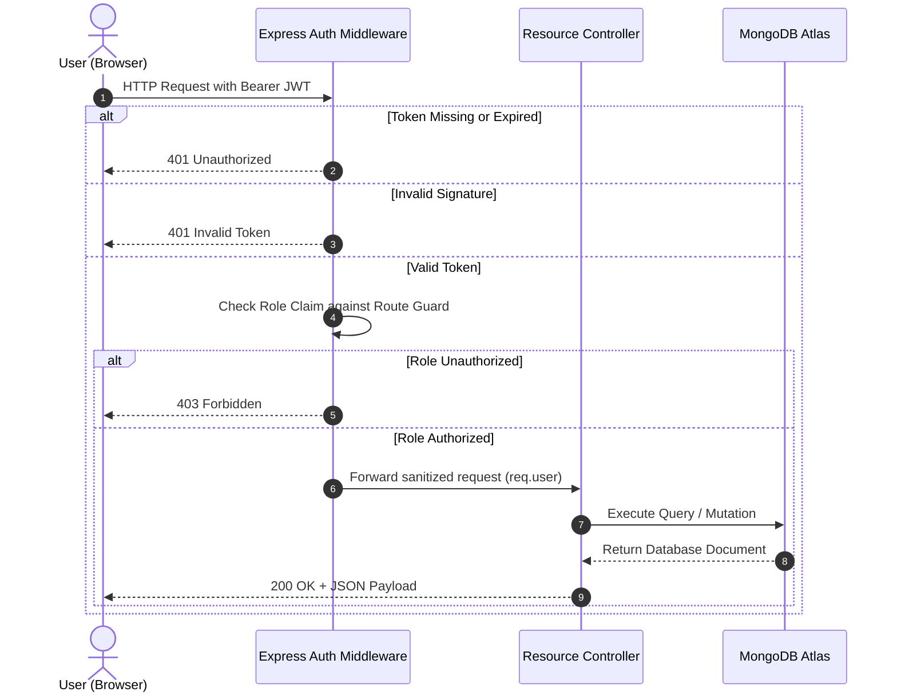

# 🏗️ System Architecture & High-Level Design

The **College Mentorship Management System (CMMS)** is architected as a modular, 3-tier client-server application adhering to modern web engineering principles. By strictly decoupling presentation logic, API orchestration, and persistence, CMMS ensures high scalability, low coupling, and rigorous security boundaries.

```
┌─────────────────────────────────────────────────────────────┐
│                 Client Layer (React 19 + Vite)              │
│       Student Portal  │  Faculty Portal  │ Admin Dashboard  │
└──────────────────────────────┬──────────────────────────────┘
                               │ HTTPS / JSON (RESTful)
                               ▼
┌─────────────────────────────────────────────────────────────┐
│                 Application Layer (Node.js + Express 5)     │
│   Auth & RBAC Middleware  │  Routing  │  Controllers        │
│   Allocation Service      │  Scheduling & Concurrency Guard │
└──────────────────────────────┬──────────────────────────────┘
                               │ Mongoose ODM / Driver
                               ▼
┌─────────────────────────────────────────────────────────────┐
│                 Data Layer (MongoDB Atlas Cluster)          │
│   Users · Mentors · Students · Meetings · Notes · Feedback  │
└─────────────────────────────────────────────────────────────┘
```

---

## 🏛️ Architectural Layers

### 1. Presentation Layer (Frontend)
- **Framework**: React 19 bootstrapped with Vite for sub-second hot-module reloading and optimized production bundles.
- **Routing**: React Router v7 providing protected route guards based on authenticated user roles (`STUDENT`, `FACULTY`, `ADMIN`).
- **State Management**: Centralized `AuthContext` maintaining JWT tokens, user profiles, and session states without external heavy boilerplate.
- **Styling**: Component-scoped CSS modules ensuring an accessible, responsive dashboard layout optimized across desktop, tablet, and mobile screens.

### 2. Application Layer (Backend REST API)
- **Runtime**: Node.js LTS with Express 5 framework.
- **Authentication**: Stateless JSON Web Tokens (JWT) signed with HMAC-SHA256 containing user ID and authorization roles.
- **Security Middleware**: 
  - `authMiddleware.js`: Validates bearer token signatures and decodes identity claims.
  - `roleMiddleware.js`: Restricts endpoint access to specific roles (e.g., preventing students from triggering mentor allocation or viewing admin analytics).
- **Concurrency Guard**: Atomic database queries with optimistic concurrency control to prevent double-booking of meeting slots during high concurrent traffic.

### 3. Data Persistence Layer (Database)
- **Database**: MongoDB Atlas cloud cluster.
- **Data Modeling**: Mongoose 8 Object Data Modeling (ODM) providing strict schema validation, referential integrity via `ObjectId` relations, and compound indexes for fast lookups.

---

## 🔒 Security Architecture



---

## 📐 System Design Artifacts

Explore each foundational design diagram of CMMS:

- [**Use Case Analysis**](use-cases.md) — Primary actors, system boundaries, and role-based permissions.
- [**Data Flow Diagrams (DFDs)**](data-flow-diagrams.md) — Level 0 Context, Level 1 Decomposition, and Level 2 Scheduling flow.
- [**Activity & Lifecycle Diagram**](activity-diagram.md) — Step-by-step operational flow from slot creation to post-meeting feedback.
- [**ER Diagram & Data Schemas**](er-diagram.md) — Relational representation of MongoDB collections and document schemas.
