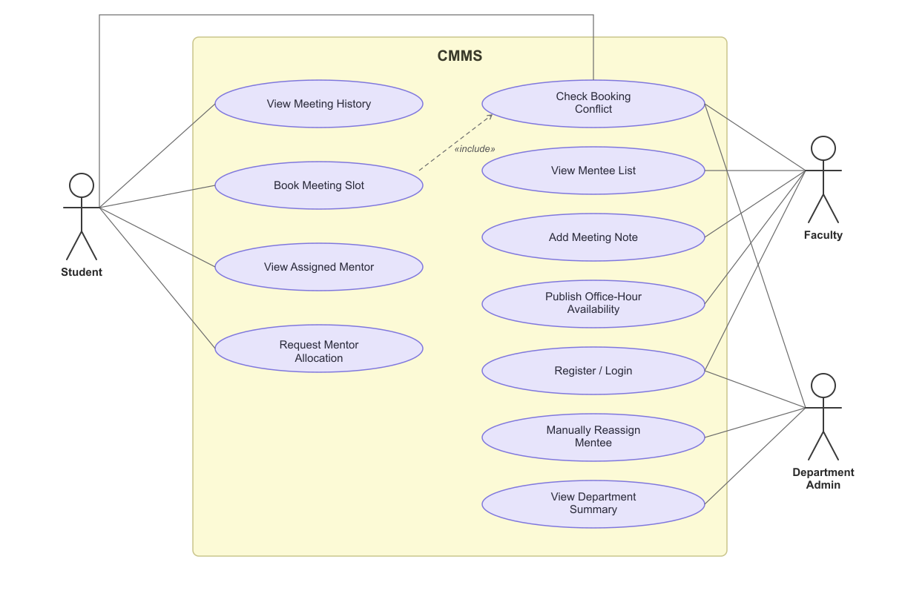

# 👥 Use Case Analysis

The Use Case model defines the functional interactions between external actors and the **College Mentorship Management System (CMMS)**. The system recognizes three primary human actors: **Student**, **Faculty Mentor**, and **Department Administrator**.

---

## 📊 Interactive Use Case Diagram

=== "Interactive Mermaid Diagram"

    ```mermaid
    graph LR
        %% Actors
        Student((Student))
        Faculty((Faculty Mentor))
        Admin((Department Admin))

        %% System Boundary
        subgraph CMMS ["College Mentorship Management System (CMMS)"]
            %% Shared Use Cases
            UC_Auth([Login / Register])

            %% Student Use Cases
            UC_S1([Set Academic Focus Area])
            UC_S2([View Assigned Mentor])
            UC_S3([Book Office Hour Slot])
            UC_S4([View Meeting History & Notes])
            UC_S5([Submit Session Feedback])

            %% Faculty Use Cases
            UC_F1([Publish Availability Slots])
            UC_F2([View Advisee Roster])
            UC_F3([Approve / Reject Bookings])
            UC_F4([Record Post-Meeting Notes])

            %% Admin Use Cases
            UC_A1([View Department Metrics])
            UC_A2([Monitor Faculty Workload])
            UC_A3([Manually Reassign Mentee])
            UC_A4([Execute Allocation Batch])
        end

        %% Connections
        Student --> UC_Auth
        Faculty --> UC_Auth
        Admin --> UC_Auth

        Student --> UC_S1
        Student --> UC_S2
        Student --> UC_S3
        Student --> UC_S4
        Student --> UC_S5

        Faculty --> UC_F1
        Faculty --> UC_F2
        Faculty --> UC_F3
        Faculty --> UC_F4

        Admin --> UC_A1
        Admin --> UC_A2
        Admin --> UC_A3
        Admin --> UC_A4

        %% Dependencies
        UC_S3 -.->|<<include>>| UC_Auth
        UC_F1 -.->|<<include>>| UC_Auth
        UC_A3 -.->|<<include>>| UC_Auth
    ```

=== "High-Resolution Render"

    <div class="diagram-frame">
      
      <div class="diagram-caption">Figure 1: High-Resolution UML Use-Case Diagram for CMMS actors.</div>
    </div>

---

## 🎭 Actor Profiles & Permissions

### 1. Student (`ROLE_STUDENT`)
The mentee pursuing undergraduate or postgraduate studies within the department.
- **Academic Profile**: Configures degree department and primary interest areas (e.g., AI/ML, Cloud Computing, Cyber Security, Systems).
- **Advisory Relationship**: Views designated faculty mentor with contact information and research profile.
- **Appointment Scheduling**: Browses real-time calendar availability published by their assigned mentor and reserves slots.
- **History & Reflection**: Accesses archived notes from past discussions and submits post-session ratings and reflections.

### 2. Faculty Mentor (`ROLE_FACULTY`)
The academic advisor responsible for guiding students through educational and career milestones.
- **Slot Management**: Creates, modifies, and publishes weekly office hour windows (start time, end time, location/mode).
- **Roster Management**: Inspects all active mentees, academic standings, and previous meeting frequencies.
- **Meeting Administration**: Accepts or reschedules appointment requests; records immutable summary notes and assigned action items immediately following each session.

### 3. Department Administrator (`ROLE_ADMIN`)
Head of Department (HoD) or designated academic coordinator overseeing mentorship health.
- **Allocation Governance**: Triggers batch mentorship assignment algorithms; balances mentor-to-mentee ratios across senior and junior faculty.
- **Exception Handling**: Manually overrides or reassigns students when faculty members go on sabbatical or study leave.
- **Executive Analytics**: Monitors department-wide engagement metrics, active vs. inactive pairings, and aggregate satisfaction scores.
