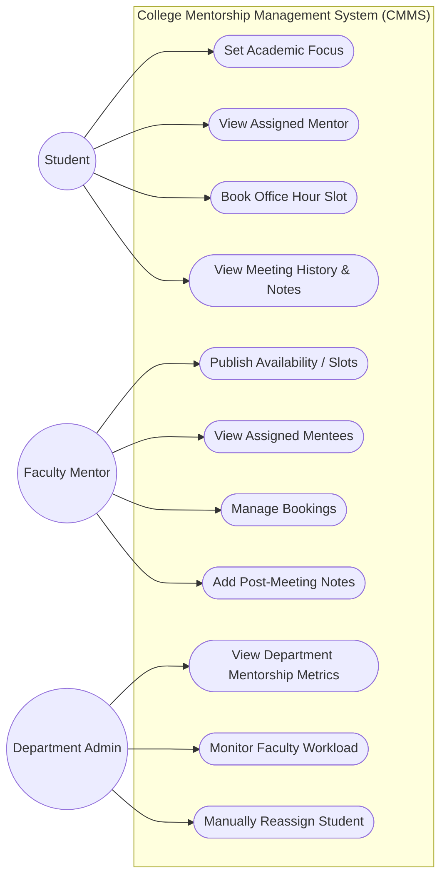
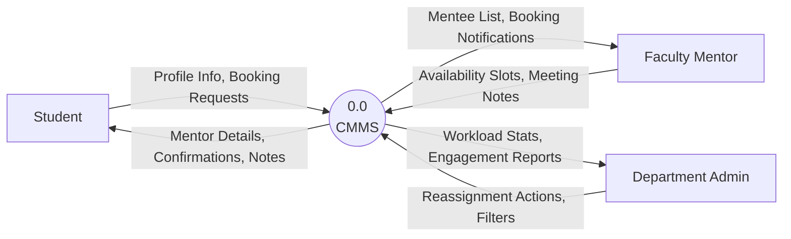
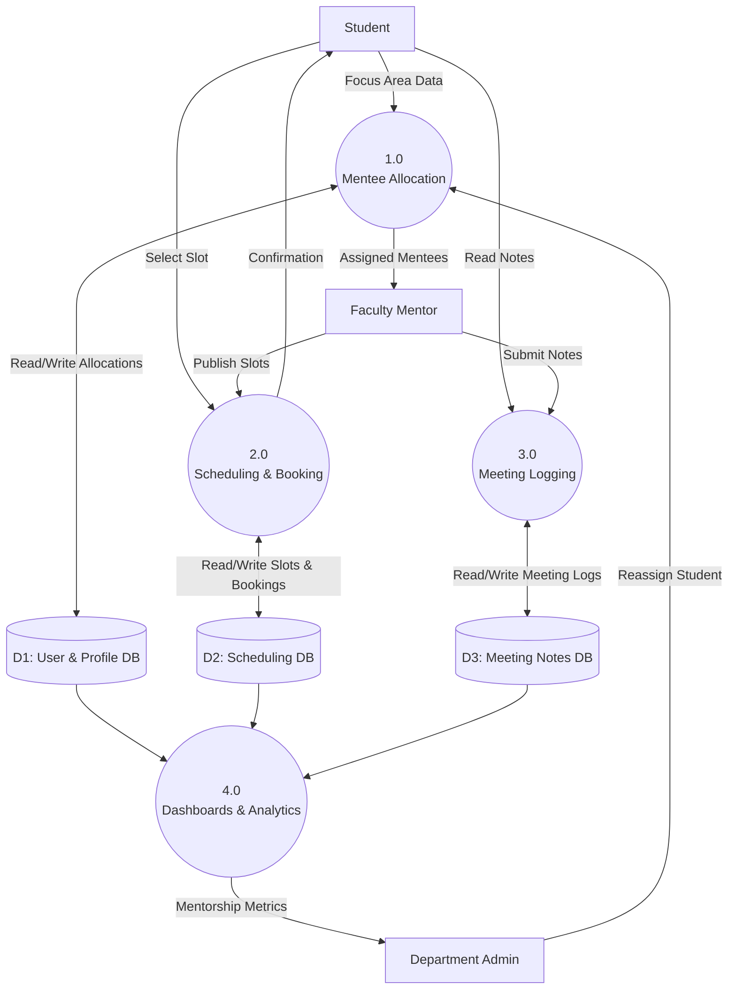
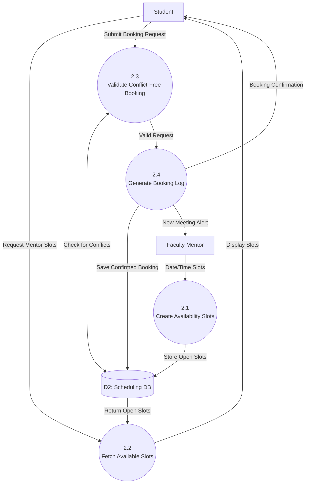

# CMMS System Design Diagrams

This document contains the foundational system design diagrams for the **College Mentorship Management System (CMMS)**. You can use these diagrams in your final project report or presentation. 

The diagrams are written in [Mermaid](https://mermaid.js.org/), which can be natively rendered in GitHub, Notion, or exported as images using the [Mermaid Live Editor](https://mermaid.live).

## 1. Use-Case Diagram

This diagram maps out the primary actors (Student, Faculty Mentor, and Department Admin) and the specific actions they can perform within the system.

---

## 2. Data Flow Diagrams (DFDs)

### Level 0 DFD (Context Diagram)

The Level 0 DFD shows the CMMS as a single, high-level process interacting with external entities (the users).

### Level 1 DFD (System Breakdown)

The Level 1 DFD breaks down the single CMMS node into the core functional modules outlined in your project proposal: Allocation, Scheduling, Meeting Logging, and Dashboards (Analytics).

### Level 2 DFD (Decomposition of "Scheduling & Booking")

This diagram zooms in on Process `2.0 Scheduling & Booking` to show the exact flow of data when a student attempts to book a mentor's office hours.

